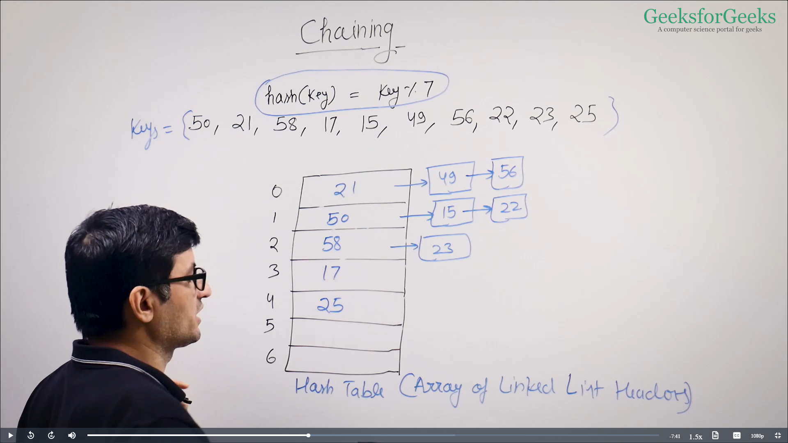
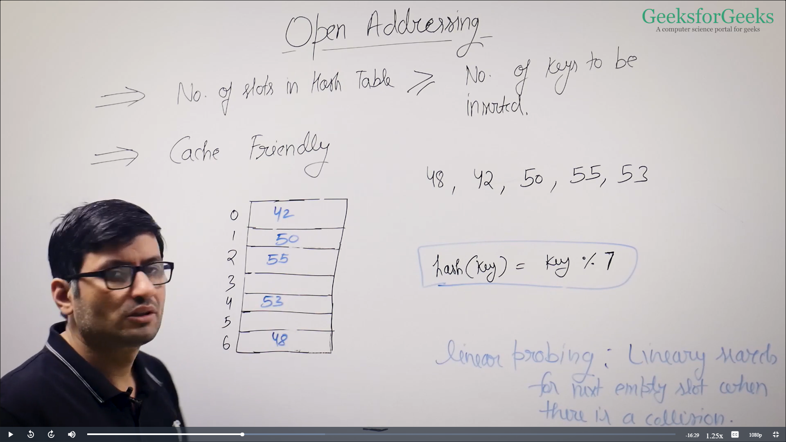

# Hashing

- the big thing about hashing is it provides search, insert and delete operations in O(1) time on average;

### not useful for:-
- finding closest value (we can use avl tree or red black tree here)
- sorted data (we can use avl tree or red black tree here)
- Prefix Searching (we can use trie ds  here)

- hashing is mostly widely use ds after array

 

### Applications of Hashing

1. Dictionaries
2. Database Indexing
3. Cryptography
4. Caches
5. Symbol Tables in Compilers / Interpreters
6. Routers
7. Caches
8. Getting data from databases
..many more

### Direct address table

- Imagine a situation where you have 1000 keys with values from (0 to 999), how would you implement following in O(1) time

1) search 2) Insert 3) Delete

example operation - 
    - insert(10)
    - search(10)
    - Delete(10)

- for this type of problem we use boolean array and initialise it with 0 and insert the +1 on insertion opertion and -1 on deletion operation this way we can do insert, search and delete operations in O(1) time

arr = {0,0,0,...,0,0,0,....,0,0,0}
```java
delete(i){
    table[i] = 0
}
```
```java
insert(i){
    table[i] = 1;
}
```

```java
search(i){
    return table[i];
}
```

- but this concept(direct address table) not handle floating point number, large values and strings

## Hashing Intro

- **hash functions** takes large values and convert them in small values and store them in **hash table** that can be use as an array 

### how hash functions work?

- should always map a large key to same small key
- should generate values from 0 to m-1
- should be fast O(1) for integers and O(len) for string of length **len**
- should uniformly distribute large keys into hash table slots

- h(large_key) = large_key % m
- for strings, weighted sum 
str[] = "abcd"

- (str[0]*x^0 + str[1]*x^1 + str[2]*x^2 + str[3]*x^4)%m
- universal hashing

### Collision Handling

- if we know keys in advance, then we can perfect hashing,
- if we do not know keys, then we use one fo the following
- chaining
- open Addressing
            -> Linear Probling
            -> Quadratic Probing
            -> Double Hashing

### Chaining

- hash(key) = key % 7
- keys = {50, 21, 58,17,15,49,56,22,23,25}
- 

#### Performance

    m = No. of slots in hash table
    n = No. of keys to be inserted

    Load factors alpha 	α=  n/m

### Data Structure for storing chains

- linked list
- dynamic sized arrays(arraylist)
- self balancing bst(avl tree, red black tree)


### Implementation of Chaining

- chaining is a way to handle collisons and hashing.
- whenever collisons happen we form a chain.
- chaining can be implemented either using linkedlist, dynamic sized array or self balancing binary search tree


class myHash{

    int bucket
    ArrayList<LinkedList<Integer>>table;
    ----
    ----

    boolean search(int key){
        int i = key % bucket;

        return table.get(i).contains(key);
    }
    ----
    ----
}

### Open Addressing

- open addressing is another way of handling chaining
- cache friendly



#### how to handle deletion in open addressing

[0,50,51,15,0,0,0,0]


insert(50), insert(51), insert(15), search(15), search(64), delete(15), search(19)

hash(key) = key%7

- **Search** : We compute hash functions we go to that index and m compare, if we find we return true, otherwise we linearly hash. We stop when one of the three cases arise 1) empty slot 2) key found 3) traversed through


## HashSet

- HashSet is used to store set of keys and  it  uses hashing

```java
class Test{

    public static void main(String args[]){

        HashSet<String> h = new HashSet<String>();

        //{in this <> we only can use non primitve data types also we can use user defined data types}

        h.add("courses");
        h.add("gfg");
        h.add("ide");

        // hashset always add the unique elements it won't allow duplicates to be present in its set;

        System.out.println(h);

        sout(h.contains("ide")); 
        // contains method return try if the given key is present 

        Iterator<String> i = h.iterator();

        while(i.hashNext())
            sout(i.next()+" ");

        
    }
}
```

- we we do traversal then there is no guarantee to print element in order their order can be anything


- size() gives you size of the set
- remove() use to remove elements from set
- another way to travers through the hashset - 
for(String s.h)
    System.out.print(s+" ");
System.out.println(h.isEmpty);

- clear() method is to clear the items from the hashset, it used when you want to test and clear the hashset after every test case

add(), remove(),contains(),size(),isEmpty() -> O(1) on average

- where we need search , insert ,delete operations or subsets of these operations we can use hashset their

## HashMap 

- hashmap is used to store key value pairs while hashset is used to store only keys

```java
class Test{

    public static void main(String args[]){

        HashMap<String,Integer> m = new HashMap(String,Integer);

        m.put("gfg",10);
        m.put("ide",15);
        m.put("courses"20);
        sout(m); //prints the hashmap

        for(map Entry<String,Integer>e: m.entrySet())
            System.out.println(e.getKey() + " "+ e.getValue());

        if(m.containsKey("ide"))
            sout("yes");
        else sout("no");

        sout(m.size());

        if(m.containsValue(15))
            sout("yes");
        else sout("no");

        sout(m.get("ide"));

        sout(m.get("practice"));

    }
}
```